# 🚨 API Key Security Issue Documentation

## Issue Summary

**Problem**: Firebase API keys were being exposed in the GitHub repository, triggering GitGuardian security alerts and creating a potential security vulnerability.

**Root Cause**: The build system was incorrectly modifying source files instead of only deploy files, causing real API keys to be committed to version control.

**Impact**: High - API keys were publicly visible in the repository history and could be accessed by anyone.

## Timeline of Events

### 1. Initial Discovery
- **Date**: October 15, 2025
- **Alert Source**: GitGuardian security scanning
- **Exposed Key**: `[REDACTED_API_KEY]`
- **Files Affected**: 
  - `src/js/config.js`
  - `dashboard.html`
  - `deploy/dashboard.html`
  - `deploy/src/js/config.js`

### 2. Problem Analysis
The build script (`build-config.js`) was configured to update both source files AND deploy files:

```javascript
// PROBLEMATIC CODE
const filesToUpdate = [
    'dashboard.html',           // ❌ SOURCE FILE - Should not be modified
    'deploy/dashboard.html',    // ✅ DEPLOY FILE - OK to modify  
    'src/js/config.js',         // ❌ SOURCE FILE - Should not be modified
    'deploy/src/js/config.js'   // ✅ DEPLOY FILE - OK to modify
];
```

This caused the real API key to be written back to source files every time `npm run build` was executed.

### 3. Failed Attempts
Multiple attempts were made to remove API keys, but they kept reappearing because:
1. The build system was still modifying source files
2. Environment variable setup was incomplete
3. Placeholders were being replaced in the wrong files

## Root Cause Analysis

### The Core Problem: Build System Design Flaw

```mermaid
graph TD
    A[npm run build] --> B[Copy source to deploy/]
    B --> C[build-config.js runs]
    C --> D[Replaces API keys in ALL files]
    D --> E[Source files get real API keys]
    E --> F[Git commit includes exposed keys]
    F --> G[🚨 GitGuardian Alert]
```



### Security Anti-Pattern Identified

The build system violated the fundamental security principle:
> **Never store secrets in version control**

**What Should Happen**:
- Source files: Contains only placeholders/environment variable references
- Deploy files: Gets real values injected at build time
- Repository: Never contains real secrets

**What Was Happening**:
- Source files: Getting real API keys during build
- Deploy files: Getting real values (correct)
- Repository: Committing real secrets (❌ CRITICAL ISSUE)

## Technical Details

### Files Involved

| File Path | Purpose | Should Contain Real Key? | Status Before Fix | Status After Fix |
|-----------|---------|------------------------|-------------------|------------------|
| `src/js/config.js` | Source configuration | ❌ Never | ❌ Real key | ✅ Environment variable |
| `dashboard.html` | Main HTML source | ❌ Never | ❌ Real key | ✅ Window environment |
| `deploy/src/js/config.js` | Built configuration | ✅ Yes (deploy only) | ✅ Real key | ✅ Real key |
| `deploy/dashboard.html` | Built HTML | ✅ Yes (deploy only) | ✅ Real key | ✅ Real key |

### Code Changes Made

#### Before (Vulnerable):
```javascript
// src/js/config.js
const firebaseConfig = {
    "apiKey": "[REDACTED_API_KEY]", // ❌ EXPOSED
    "authDomain": "nan-diary-6cdba.firebaseapp.com",
    // ...
};
```

#### After (Secure):
```javascript
// src/js/config.js
const firebaseConfig = {
    "apiKey": process.env.FIREBASE_API_KEY || "SECURE_PLACEHOLDER_DO_NOT_COMMIT_REAL_KEY",
    "authDomain": "nan-diary-6cdba.firebaseapp.com",
    // ...
};
```

## Solution Implementation

### 1. Fixed Build System

**Updated `build-config.js`**:
```javascript
// FIXED: Only update deploy files, never source files
const filesToUpdate = [
    'deploy/dashboard.html',     // ✅ Deploy only
    'deploy/src/js/config.js'    // ✅ Deploy only
];
```

### 2. Environment Variable System

**Local Development** (`.env.local`):
```bash
FIREBASE_API_KEY=your-actual-api-key-here
```

**Production** (GitHub Actions):
```yaml
env:
  FIREBASE_API_KEY: ${{ secrets.FIREBASE_API_KEY }}
```

### 3. Source Code Security

**JavaScript Files**:
```javascript
const firebaseConfig = {
    "apiKey": process.env.FIREBASE_API_KEY || "SECURE_PLACEHOLDER_DO_NOT_COMMIT_REAL_KEY"
};
```

**HTML Files**:
```javascript
window.ENV = window.ENV || {};
window.ENV.FIREBASE_API_KEY = window.ENV.FIREBASE_API_KEY || "SECURE_PLACEHOLDER_DO_NOT_COMMIT_REAL_KEY";

const firebaseConfig = {
    "apiKey": window.ENV.FIREBASE_API_KEY
};
```

## Verification Steps

### 1. Source File Security Check
```bash
# Should find NO API keys in source files
findstr "AIza" src\*.* dashboard.html index.html
# Expected: No results found ✅
```

### 2. Build System Test
```bash
# Remove environment variable
Remove-Item Env:FIREBASE_API_KEY -ErrorAction SilentlyContinue

# Build project
npm run build

# Check source files are still clean
findstr "AIza" src\*.* dashboard.html
# Expected: No results found ✅

# Check deploy files have placeholder
findstr "SECURE_PLACEHOLDER" deploy\src\js\config.js
# Expected: Placeholder found ✅
```

### 3. Environment Variable Test
```bash
# Set environment variable
$env:FIREBASE_API_KEY="test-key-value"

# Build project
npm run build

# Check deploy files have real key
findstr "test-key-value" deploy\src\js\config.js
# Expected: Real key found in deploy files only ✅
```

## Prevention Measures

### 1. Build System Rules
- ✅ **Rule**: Never modify source files in build process
- ✅ **Rule**: Only inject secrets into deploy directory
- ✅ **Rule**: Deploy directory must be in `.gitignore`

### 2. Code Review Checklist
- [ ] No hardcoded API keys in source files
- [ ] Environment variables used for all secrets
- [ ] Build scripts only modify `deploy/` directory
- [ ] `.gitignore` includes `deploy/` and `.env.local`

### 3. Automated Checks
- ✅ GitGuardian scanning enabled
- ✅ ESLint security rules
- ✅ Pre-commit hooks (recommended)

### 4. Development Workflow
```bash
# Safe development cycle
1. Edit source files (with placeholders only)
2. Set environment variables
3. Run build (creates deploy files with real keys)
4. Test locally using deploy files
5. Commit source files (no real keys)
6. Push to GitHub (CI/CD uses secrets)
```

## Lessons Learned

### 1. **Separation of Concerns**
- Source code should never contain production secrets
- Build process should handle secret injection
- Different configurations for different environments

### 2. **Build System Design**
- Build processes should be read-only for source files
- Output should go to separate directory
- Clear distinction between source and built artifacts

### 3. **Security by Design**
- Default to secure (placeholders)
- Explicit secret injection only where needed
- Multiple layers of verification

### 4. **Environment Management**
- Local development: `.env.local` (git ignored)
- CI/CD: Repository secrets
- Production: Environment variables

## Recovery Checklist

If this issue occurs again:

### Immediate Actions (Critical - Do First)
- [ ] 1. **Revoke exposed API key** in Google Cloud Console
- [ ] 2. **Remove API keys from all source files** 
- [ ] 3. **Commit removal** to stop further exposure
- [ ] 4. **Generate new restricted API key**

### System Fixes (Important - Do Next)
- [ ] 5. **Fix build system** to not modify source files
- [ ] 6. **Implement environment variable system**
- [ ] 7. **Add new API key to GitHub secrets**
- [ ] 8. **Test build system thoroughly**

### Verification (Essential - Do Last)
- [ ] 9. **Verify no API keys in source files**
- [ ] 10. **Test deployment pipeline**
- [ ] 11. **Monitor for security alerts**
- [ ] 12. **Document changes**

## Best Practices Going Forward

### 1. **Never Commit Secrets**
```bash
# Good: Environment variable
apiKey: process.env.FIREBASE_API_KEY

# Bad: Hardcoded secret
apiKey: "[REDACTED_API_KEY]"
```

### 2. **Secure Build Process**
```bash
# Good: Only modify deploy files
const filesToUpdate = ['deploy/config.js']

# Bad: Modify source files
const filesToUpdate = ['src/config.js', 'deploy/config.js']
```

### 3. **Multi-Layer Security**
- Git hooks for secret detection
- CI/CD secret scanning
- Regular security audits
- Principle of least privilege for API keys

### 4. **Development Environment**
```bash
# Setup for new developers
1. Copy .env.example to .env.local
2. Add your API key to .env.local
3. Never commit .env.local
4. Use npm run build for testing
```

## Monitoring and Alerts

### Current Setup
- ✅ GitGuardian monitoring enabled
- ✅ GitHub security alerts active
- ✅ ESLint security rules configured

### Recommended Additions
- [ ] Pre-commit hooks for secret detection
- [ ] Automated security scanning in CI/CD
- [ ] Regular API key rotation schedule
- [ ] Security incident response plan

## Contact and Resources

- **Security Team**: Report incidents immediately
- **Documentation**: Keep this guide updated with any changes
- **Tools**: GitGuardian, ESLint security, GitHub Advanced Security
- **References**: Firebase security best practices, OWASP guidelines

---

**Last Updated**: October 15, 2025  
**Document Version**: 1.0  
**Next Review**: Monthly or after any security incidents